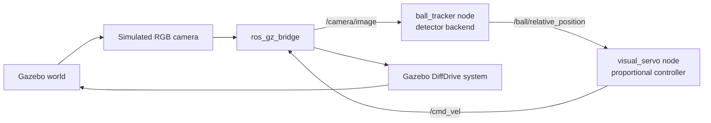

# Vision Guided Robot

A learning-first ROS 2 project for a simulated differential-drive robot that uses a camera to find, track, and approach a red ball in Gazebo.

The first goal is intentionally simple: build the full robotics loop before adding machine learning.



## Target Stack

- Python
- ROS 2 Humble
- Gazebo Harmonic or newer
- `ros_gz_sim` and `ros_gz_bridge`
- OpenCV
- No hardware required

Gazebo Classic is intentionally avoided because modern ROS 2/Gazebo projects use the `ros_gz` bridge and Gazebo Sim stack.

## Repository Layout

```text
.
|-- README.md
|-- docs/
|   |-- architecture.md
|   |-- file_guide.md
|   |-- interview_review.md
|   |-- issues.md
|   `-- roadmap.md
|-- pyproject.toml
|-- requirements-dev.txt
`-- src/
    `-- vision_guided_robot/
        |-- config/
        |-- launch/
        |-- models/
        |-- test/
        |-- vision_guided_robot/
        |-- worlds/
        |-- package.xml
        |-- setup.cfg
        `-- setup.py
```

See [docs/file_guide.md](docs/file_guide.md) for an explanation of every file.

## Build And Run

From this repository root on a ROS 2 machine:

```bash
source /opt/ros/humble/setup.bash
rosdep install --from-paths src --ignore-src -r -y
colcon build --symlink-install
source install/setup.bash
ros2 launch vision_guided_robot sim.launch.py
```

Expected behavior:

1. Gazebo opens with a small differential-drive robot and a red ball.
2. The camera image is bridged into ROS 2 on `/camera/image`.
3. `ball_tracker` detects the ball and publishes `/ball/relative_position`.
4. `visual_servo` publishes `/cmd_vel`.
5. The robot turns toward the ball, drives forward, and stops near it.

## Local Python Tests

The detector and controller are written so their core logic can be tested without ROS:

```bash
python -m pip install -r requirements-dev.txt
python -m pytest
```

The ROS nodes wrap that testable core logic in subscriptions, publishers, parameters, and launch files.

## Learning Path

Start here:

- [docs/project_portfolio.md](docs/project_portfolio.md) for the final portfolio-style project summary, architecture, demos, validation evidence, and limitations.
- [docs/status.md](docs/status.md) for what is done, what remains, and final validation commands.
- [docs/final_demo_report.md](docs/final_demo_report.md) for one-command HSV and ONNX demos plus the final comparison table.
- [docs/roadmap.md](docs/roadmap.md) for milestones, weekly plan, and required skills.
- [docs/issues.md](docs/issues.md) for GitHub-style tickets ordered from beginner to advanced.
- [docs/architecture.md](docs/architecture.md) for the robotics and ROS architecture.
- [docs/experiments.md](docs/experiments.md) for repeatable ball-position trials.
- [docs/controller_tuning.md](docs/controller_tuning.md) for comparing controller gains and speed limits.
- [docs/perception_robustness.md](docs/perception_robustness.md) for detector stress tests.
- [docs/webcam_perception.md](docs/webcam_perception.md) for real-camera perception practice.
- [docs/detector_evaluation.md](docs/detector_evaluation.md) for saved-image detector benchmarking.
- [docs/distance_calibration.md](docs/distance_calibration.md) for calibrating detector pixel size into metric distance.
- [docs/dataset_prep.md](docs/dataset_prep.md) for creating a custom YOLO-format red-ball dataset.
- [docs/ml_detector_plan.md](docs/ml_detector_plan.md) for the staged ML replacement plan.
- [docs/ml_onnx_backend.md](docs/ml_onnx_backend.md) for the ONNX detector backend scaffold.
- [docs/ml_detector_comparison.md](docs/ml_detector_comparison.md) for the HSV vs custom YOLO comparison and final ONNX robot trial.
- [docs/ml_dataset_plan.md](docs/ml_dataset_plan.md) for the custom red-ball dataset plan.
- [docs/obstacle_avoidance.md](docs/obstacle_avoidance.md) for the lidar safety layer.
- [docs/odometry_rviz.md](docs/odometry_rviz.md) for odometry, TF, and RViz visualization.
- [docs/waypoint_navigation.md](docs/waypoint_navigation.md) for odometry-based waypoint driving.
- [docs/path_planning.md](docs/path_planning.md) for A* grid planning, live lidar obstacle cells, and planned path following.
- [docs/nav2_comparison.md](docs/nav2_comparison.md) for the first Nav2 comparison milestone.
- [docs/navigation_comparison.md](docs/navigation_comparison.md) for custom planner vs Nav2 results.
- [docs/navigation_final_report.md](docs/navigation_final_report.md) for the final custom-vs-Nav2 navigation summary.
- [docs/map_localization.md](docs/map_localization.md) for saved-map AMCL localization and `map`-frame Nav2 goals.
- [docs/nav2_amcl_wall_passing.md](docs/nav2_amcl_wall_passing.md) for the harder map-frame wall-passing experiment.
- [docs/interview_review.md](docs/interview_review.md) for startup-interview-style review questions.

## Core Robotics Ideas

- Perception turns pixels into a target estimate.
- Control turns the target estimate into velocity commands.
- Standalone webcam testing separates perception debugging from robot-control debugging.
- Detector backend selection keeps the HSV baseline stable while supporting the custom ONNX model.
- Offline detector evaluation gives HSV and ML backends the same saved-image scoreboard.
- Dataset audits catch broken labels before training a custom detector.
- Gazebo provides physics, robot dynamics, sensors, and a repeatable test world.
- ROS 2 connects independent programs through topics and launch files.
- The pinhole camera model estimates object distance from apparent size.
- A neural detector can improve recognition, but it does not remove the need for calibration and geometry.
- Distance estimates need calibration because detector boxes are image-space measurements, not metric truth.
- A custom YOLO detector needs examples from the same visual domain where it will run.
- TF connects robot, sensor, and odometry coordinate frames for visualization and navigation.
- Waypoint control uses odometry, heading error, and proportional control to drive to a goal.
- Mission state separates local controller progress from higher-level task health.
- A progress watchdog can detect when reactive safety is no longer making progress.
- Simple rerouting can insert temporary detour waypoints before returning to the original goal.
- A* path planning searches an occupancy grid before motion starts, instead of waiting for the robot to hit a safety condition.
- Live scan planning projects lidar hits into the odom grid so the planner can use sensed obstacles instead of only hardcoded rectangles.
- Nav2 comparison shows how a production ROS 2 navigation stack organizes costmaps, planners, controllers, behavior trees, and lifecycle nodes.
- AMCL connects a saved map to live odometry by estimating the `map -> odom` transform.
- RViz path and footprint displays make odometry drift and robot clearance easier to inspect.

## Official References

- Gazebo ROS 2 launch integration: https://gazebosim.org/docs/harmonic/ros2_launch_gazebo/
- `ros_gz_bridge` topic and YAML configuration: https://docs.ros.org/en/jazzy/p/ros_gz_bridge/
- Gazebo camera sensor tutorial: https://gazebosim.org/docs/harmonic/sensors/
