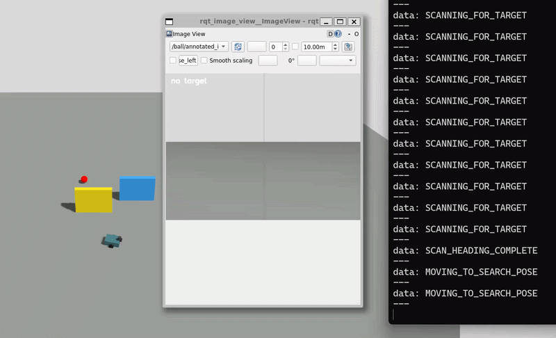
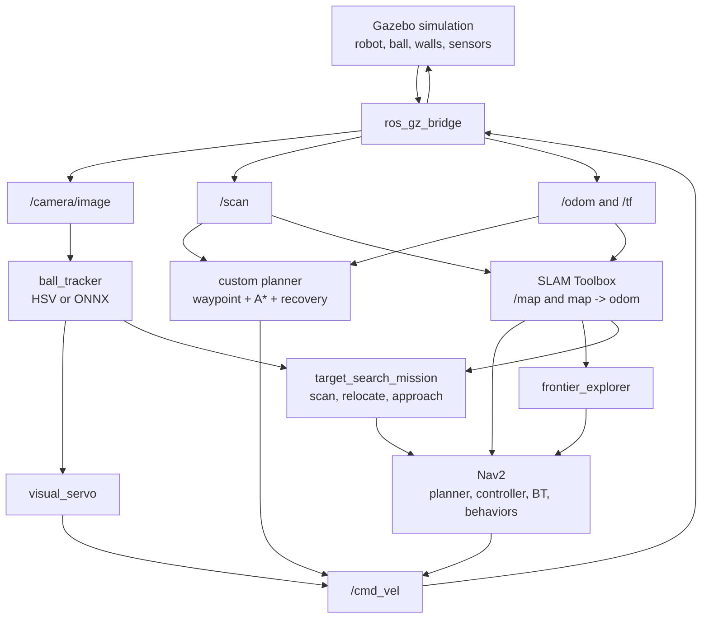

# Vision-Guided Robot

A ROS 2 + Gazebo robotics project that grows from simple camera-based object tracking into a full simulated mobile-robot stack with perception, control, obstacle avoidance, path planning, Nav2, AMCL localization, SLAM, and autonomous frontier exploration.

This project was built as a learning-first robotics portfolio: every major capability has code, launch files, documentation, and rosbag-based validation evidence.

## Demo Preview



Two-wall search-and-approach demo: the robot scans for the ball, moves toward the corridor, scans again, then continues the mission behavior once the target is visible.

```bash
ros2 launch vision_guided_robot demo_search_ball_two_walls.launch.py rviz:=true
```

## What It Demonstrates

- Differential-drive robot simulation in Gazebo
- ROS 2 topics, launch files, TF, odometry, lidar, camera, and RViz
- OpenCV HSV red-ball detection and custom YOLO11n ONNX detection
- Visual servoing to approach and stop near a colored object
- Lidar-based safety filtering and obstacle avoidance
- Custom waypoint navigation, A* planning, path following, persistent costmap memory, and recovery
- Nav2 integration with planners, controllers, costmaps, behavior actions, and lifecycle nodes
- AMCL localization on a saved map
- SLAM Toolbox mapping from live `/scan`
- Autonomous frontier exploration using the live SLAM map
- Search-and-approach behavior: explore behind walls until the camera finds the ball, then travel to it
- Repeatable validation with rosbag analysis

## Quick Results

| Capability | Evidence | Result |
| --- | --- | --- |
| Camera target approach | `bags/final_vision_approach` | HSV detector centered and stopped near the ball |
| Custom ONNX detector | `bags/final_onnx_far_improved` | YOLO11n ONNX drove from `1.788 m` to stop |
| Custom path planning | `bags/final_persistent_costmap_planner` | Planned path followed to goal with persistent obstacle memory |
| Nav2 navigation | `bags/final_nav2_tight_goal` | Nav2 reached goal within `0.118 m` |
| AMCL localization | `bags/final_nav2_amcl_clear_goal` | Map-frame goal succeeded with `/amcl_pose` |
| SLAM mapping | `bags/final_slam_mapping_first_run` | Live map published 233 samples and Nav2 succeeded |
| Robot-built map navigation | `bags/final_slam_map_amcl_fast_run2` | AMCL + fast Nav2 succeeded on saved SLAM map |
| Frontier exploration | `bags/final_frontier_exploration` | 3 goals sent, 2 succeeded, map grew to `269x242` |

See [docs/project_portfolio.md](docs/project_portfolio.md) for the full portfolio report.

## Architecture



## Run The Project

From the repository root on Ubuntu 22.04 with ROS 2 Humble:

```bash
source /opt/ros/humble/setup.bash
rosdep install --from-paths src --ignore-src -r -y
colcon build --symlink-install
source install/setup.bash
```

Headline autonomous exploration demo:

```bash
ros2 launch vision_guided_robot demo_slam_explore.launch.py rviz:=true max_goals:=6
```

Two-wall search-and-approach demo:

```bash
ros2 launch vision_guided_robot demo_search_ball_two_walls.launch.py rviz:=true
```

Object approach demo:

```bash
ros2 launch vision_guided_robot demo_hsv.launch.py
```

Custom ONNX detector demo:

```bash
ros2 launch vision_guided_robot demo_onnx.launch.py
```

Nav2 on robot-built map:

```bash
ros2 launch vision_guided_robot demo_nav2_slam_map.launch.py rviz:=true
```

## Repository Tour

Start here if you are reviewing the project:

- [docs/project_portfolio.md](docs/project_portfolio.md): polished project summary, architecture, evidence, and limitations
- [docs/github_showcase.md](docs/github_showcase.md): how to record and publish a GitHub demo clip
- [docs/status.md](docs/status.md): completed milestones and validation bags
- [docs/autonomous_exploration.md](docs/autonomous_exploration.md): frontier exploration implementation and validation
- [docs/search_and_approach.md](docs/search_and_approach.md): two-wall ball search and target-approach demo
- [docs/slam_mapping.md](docs/slam_mapping.md): SLAM Toolbox mapping and robot-built-map navigation
- [docs/navigation_final_report.md](docs/navigation_final_report.md): custom navigation vs Nav2 comparison
- [docs/ml_detector_comparison.md](docs/ml_detector_comparison.md): HSV vs ONNX detector comparison
- [docs/architecture.md](docs/architecture.md): ROS 2 architecture and node responsibilities
- [docs/issues.md](docs/issues.md): GitHub-style learning curriculum

Important code paths:

```text
src/vision_guided_robot/vision_guided_robot/
  ball_tracker_node.py          # camera perception ROS node
  red_ball_detector.py          # OpenCV HSV detector
  yolo_onnx_detector.py         # custom ONNX detector backend
  visual_servo_node.py          # camera target approach controller
  safety_filter_node.py         # lidar safety layer
  grid_planner_node.py          # educational A* planner wrapper
  waypoint_driver_node.py       # waypoint/path follower and recovery
  frontier_explorer_node.py     # autonomous exploration goal generator
  target_search_mission_node.py # scan, relocate, and approach hidden target

src/vision_guided_robot/launch/
  demo_hsv.launch.py
  demo_onnx.launch.py
  demo_live_planned.launch.py
  demo_nav2_slam_map.launch.py
  demo_slam_explore.launch.py
  demo_search_ball_two_walls.launch.py
```

## Validation Workflow

Most milestones were recorded as ROS bags and summarized with:

```bash
python3 tools/analyze_bag.py bags/final_frontier_exploration
```

Example final frontier-exploration result:

```text
explorer_goal_samples: 3
map_samples: 251
map_size: 269x242 @ 0.050 m/px
max_linear_mps: 1.500
max_angular_radps: 2.800
explorer_state_counts:
  GOAL_SUCCEEDED: 2
  NAVIGATING: 32
  SENDING_GOAL: 3
explorer_success: True
success: True
```

## Tests

Core robotics and perception logic is tested outside ROS where possible:

```bash
python -m pip install -r requirements-dev.txt
python -m pytest
```

## Known Limitations

- Simulation-only; hardware would require sensor calibration, timing work, and safety checks.
- The custom planner is educational and not a replacement for Nav2.
- ONNX detection is slower than HSV on CPU and depends on dataset quality.
- Distance estimation from image boxes is approximate.
- Frontier exploration is a first-pass heuristic and does not yet blacklist failed frontiers.

## License

This project is released under the MIT License. See [LICENSE](LICENSE).
