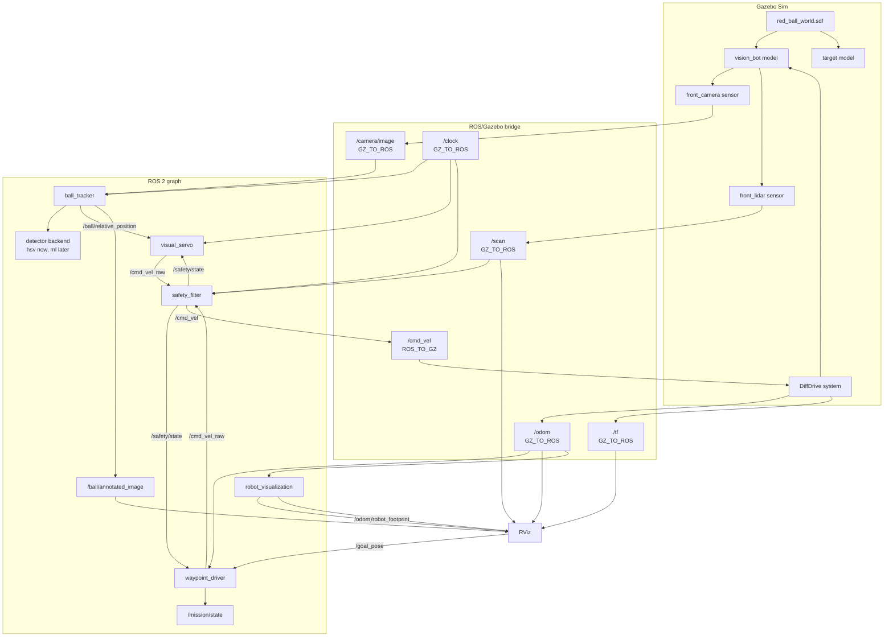

# Architecture

This project is now a closed-loop robot with a separate safety layer:

1. A simulated camera sees the world.
2. A detector backend detects a red ball in the camera image.
3. The detector estimates where the ball is relative to the camera.
4. A selected controller publishes desired velocity on `/cmd_vel_raw`.
5. A simulated lidar publishes obstacle ranges on `/scan`.
6. A safety filter turns `/cmd_vel_raw` into final `/cmd_vel`.
7. Gazebo publishes wheel odometry as `/odom` and the `odom -> base_link` transform.
8. Static transforms connect `base_link` to the lidar and camera frames.
9. The active controller watches `/safety/state` so behavior can react to avoidance.
10. Gazebo applies `/cmd_vel` to the differential-drive robot.

## System Diagram



## Topic Contract

| Topic | Type | Direction | Meaning |
| --- | --- | --- | --- |
| `/camera/image` | `sensor_msgs/msg/Image` | Gazebo to ROS | RGB image from the simulated camera |
| `/camera/camera_info` | `sensor_msgs/msg/CameraInfo` | Gazebo to ROS | Camera calibration metadata |
| `/scan` | `sensor_msgs/msg/LaserScan` | Gazebo to ROS | Lidar ranges for obstacle safety |
| `/odom` | `nav_msgs/msg/Odometry` | Gazebo to ROS | Estimated robot pose and twist from differential-drive odometry |
| `/tf` | `tf2_msgs/msg/TFMessage` | Gazebo/static publishers to ROS | Frame transforms such as `odom -> base_link` |
| `/odom_path` | `nav_msgs/msg/Path` | Visualization to RViz | Accumulated odometry trajectory |
| `/robot_footprint` | `visualization_msgs/msg/Marker` | Visualization to RViz | Top-down robot base footprint in `base_link` |
| `/goal_pose` | `geometry_msgs/msg/PoseStamped` | RViz to waypoint control | Interactive waypoint goal in the odom frame |
| `/ball/relative_position` | `geometry_msgs/msg/PointStamped` | Perception to control | Ball estimate in camera optical coordinates |
| `/ball/annotated_image` | `sensor_msgs/msg/Image` | Perception debug output | Image with detector overlay |
| `/cmd_vel_raw` | `geometry_msgs/msg/Twist` | Control to safety | Desired robot body velocity |
| `/cmd_vel` | `geometry_msgs/msg/Twist` | ROS to Gazebo | Safety-filtered robot body velocity |
| `/visual_servo/state` | `std_msgs/msg/String` | Control debug output | Current behavior state: `SEARCH`, `RECOVER`, `TRACK`, `APPROACH`, or `STOP` |
| `/waypoint/state` | `std_msgs/msg/String` | Waypoint debug output | Current waypoint state: `WAITING_FOR_GOAL`, `WAITING_FOR_ODOM`, `ROTATE_TO_GOAL`, `DRIVE_TO_GOAL`, `ROTATE_TO_FINAL`, or `DONE` |
| `/waypoint/progress` | `std_msgs/msg/String` | Waypoint debug output | Current mission index and active goal |
| `/mission/state` | `std_msgs/msg/String` | Mission debug output | Higher-level waypoint mission state: `WAITING_FOR_GOAL`, `NAVIGATING`, `REROUTING`, `PAUSED_FOR_SAFETY`, `BLOCKED`, or `DONE` |
| `/safety/state` | `std_msgs/msg/String` | Safety debug output | Current safety state: `CLEAR`, `SLOW`, `BLOCKED`, `AVOID`, or `STALE_SCAN` |
| `/clock` | `rosgraph_msgs/msg/Clock` | Gazebo to ROS | Simulation time |

## Coordinate Convention

`ball_tracker` publishes `/ball/relative_position` using a camera optical frame convention:

- `point.z`: estimated forward distance to the ball, in meters.
- `point.x`: estimated lateral offset, positive when the ball appears to the right side of the image.
- `point.y`: reserved for vertical offset and currently set to `0.0`.

The controller uses:

```text
angle_error = atan2(lateral_offset, forward_distance)
angular_z = -kp_angular * angle_error
linear_x = kp_linear * (forward_distance - stop_distance)
```

The negative sign on `angular_z` appears because a ball on the right side of the image has positive optical-frame `x`, but a positive ROS base-frame yaw command turns the robot left.

## Behavior States

`visual_servo` has a finite-state controller:

| State | Meaning | Command style |
| --- | --- | --- |
| `SEARCH` | Target is missing or stale | Keep rotating for a full scan, biased toward the last-seen target side |
| `RECOVER` | Target was recently lost, or avoidance just cleared | Briefly turn toward the last side where the target was seen |
| `TRACK` | Target is visible but far off-center | Turn in place to center the ball |
| `APPROACH` | Target is visible and roughly centered | Drive forward while correcting heading |
| `STOP` | Target is close enough | Publish zero desired velocity and hold briefly through detector flicker |

## Safety States

`safety_filter` is a reactive safety layer, not a full path planner:

| State | Meaning | Command style |
| --- | --- | --- |
| `CLEAR` | No front obstacle is close | Pass `/cmd_vel_raw` through |
| `SLOW` | Obstacle is ahead but not critical | Scale forward velocity down |
| `BLOCKED` | Obstacle is too close | Stop forward motion and turn toward the clearer side |
| `AVOID` | Latched maneuver after a block | Keep the chosen turn direction and creep forward when the center path allows |
| `STALE_SCAN` | Lidar data is missing or old | Stop |

## Mission States

The waypoint driver separates controller progress from mission health:

| State | Meaning |
| --- | --- |
| `WAITING_FOR_GOAL` | No active waypoint goal exists |
| `NAVIGATING` | The waypoint controller is driving toward an active goal |
| `REROUTING` | The waypoint controller is following a temporary detour before resuming the original goal |
| `PAUSED_FOR_SAFETY` | The safety filter is interrupting motion for avoidance or stale lidar data |
| `BLOCKED` | Safety has interrupted too long, or repeated safety interruptions happen without enough distance-to-goal improvement |
| `DONE` | The active waypoint goal has been reached while safety is clear |

## Why No Neural Network Yet

A handcrafted red-ball detector teaches the full robotics loop with very little infrastructure:

- image preprocessing
- segmentation
- contour filtering
- camera geometry
- control feedback
- ROS topic design
- reactive safety filtering

After the loop works, a neural detector can replace only the perception implementation while the controller, safety layer, and simulator stay mostly unchanged.

## Detector Backend Boundary

`ball_tracker` and `webcam_detector` both use the same backend factory:

```text
image -> create_detector_backend("hsv") -> detect(image) -> Detection | None
```

The current production baseline is `hsv`, which wraps the OpenCV red-object detector. An `onnx` backend scaffold also exists for offline ML experiments. The controller still receives the same `/ball/relative_position` topic, so ML work should change the detector implementation, not the robot-control contract.
