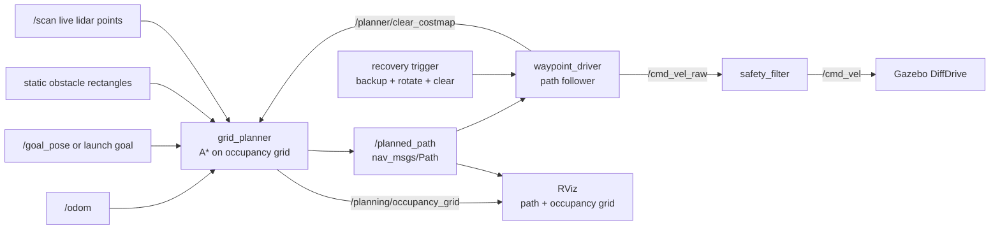

# Real Path Planning Navigation

This phase upgrades the project from reactive obstacle avoidance to planned navigation.

The first implementation is a small global planner:

```text
goal + odom + static obstacle map -> A* grid planner -> /planned_path -> waypoint_driver -> /cmd_vel_raw
```

The second step adds live lidar obstacle cells:

```text
/scan + odom -> live occupied cells -> A* grid planner -> /planned_path
```

The third step adds a short-lived persistent costmap:

```text
/scan + odom -> remembered occupied cells with timeout -> A* grid planner -> /planned_path
```

The fourth step adds local recovery:

```text
blocked or no path -> back up -> rotate -> clear local costmap -> wait for replan -> follow new path
```

It is not full Nav2 yet. It is the learning bridge between your custom waypoint controller and a production navigation stack.

## Architecture



## What Changed

New files:

- `grid_planner.py`: pure Python A* planner on a 2D occupancy grid
- `grid_planner_node.py`: ROS 2 node that publishes `/planned_path`
- `persistent_costmap.py`: pure Python short-lived obstacle memory for scan-derived cells
- `path_follower.py`: pure Python lookahead path follower for smoother local tracking
- `recovery_behavior.py`: pure Python backup/rotate/clear/wait recovery sequence
- `config/planner.yaml`: map bounds, resolution, obstacle inflation, static rectangles
- `demo_planned.launch.py`: one-command planned-navigation demo
- `demo_live_planned.launch.py`: one-command demo that builds obstacle cells from `/scan`
- `demo_two_obstacle_planned.launch.py`: matched two-obstacle custom planner recovery scenario

Updated files:

- `waypoint_driver_node.py`: subscribes to `/planned_path` and follows the planned waypoints
- `waypoint_driver_node.py`: also triggers recovery on planned-navigation block, planner `NO_PATH`, or `/recovery/trigger`
- `grid_planner_node.py`: subscribes to `/planner/clear_costmap` and clears scan-derived obstacle memory before replanning
- `sim.launch.py`: adds `control_mode:=planned` and recovery parameters
- `rviz/vision_guided_robot.rviz`: displays `/planned_path` and `/planning/occupancy_grid`
- `tools/analyze_bag.py`: reports planner states and planned path samples

## Run It

Copy the new files into Ubuntu, build, and launch:

```bash
cd ~/vision_guided_robot_ws
source /opt/ros/humble/setup.bash
colcon build --symlink-install
source install/setup.bash

ros2 launch vision_guided_robot demo_planned.launch.py
```

Expected behavior:

1. Gazebo opens with the robot and wall.
2. RViz opens.
3. `/planning/occupancy_grid` shows the inflated wall region.
4. `/planned_path` shows the A* route around the wall.
5. The waypoint driver follows that path to the goal.

## Run Live Lidar Planning

This version does not give the planner the wall rectangle. It spawns the wall in Gazebo, waits for `/scan`, marks scan hits as occupied cells, and plans around those cells.

```bash
ros2 launch vision_guided_robot demo_live_planned.launch.py
```

Expected planner sequence:

```text
WAITING_FOR_SCAN
PLANNED
```

The launch preset uses:

```text
planner_obstacles_text: ""
planner_use_scan_obstacles: true
planner_require_scan_for_planning: true
planner_replan_on_scan_change: false
planner_replan_when_path_blocked: true
planner_replan_cooldown_s: 2.0
planner_keep_last_scan_map: true
planner_persistent_scan_map: true
planner_scan_memory_time_s: 12.0
path_following_mode: pure_pursuit
path_lookahead_distance_m: 0.45
```

`replan_on_scan_change` is off by default because tiny scan changes can continuously reset the waypoint follower. Instead, the planner keeps the last valid scan map and only replans when live scan cells intersect the current path.

`persistent_scan_map` remembers scan-derived occupied cells for a short time. This makes the planner less fragile when the robot turns and the lidar no longer sees a wall from the same angle.

Tune costmap memory:

```bash
ros2 launch vision_guided_robot demo_live_planned.launch.py \
  planner_scan_memory_time_s:=20.0
```

Disable memory and use only the latest/last scan map:

```bash
ros2 launch vision_guided_robot demo_live_planned.launch.py \
  planner_persistent_scan_map:=false
```

## Useful Topics

```bash
ros2 topic echo /planner/state
ros2 topic echo /waypoint/progress
ros2 topic echo /mission/state
ros2 topic echo /planned_path --once
ros2 topic echo /planning/occupancy_grid --once
```

Expected planner state:

```text
data: PLANNED
```

It is okay to see `WAITING_FOR_SCAN` briefly at startup. After the first valid live scan plan, the planner should keep publishing `PLANNED` even if later scans are temporarily empty.

## Smooth Path Following

The original waypoint driver treated a planned path as separate point goals:

```text
rotate -> drive to waypoint 1 -> rotate -> drive to waypoint 2 -> ...
```

The smoother mode uses a lookahead target:

```text
find nearest point on path -> look ahead 0.45 m -> steer toward that moving target
```

This is a pure-pursuit-style controller. It is still simple, but it makes planned navigation feel more like following a route and less like stopping at every corner.

Run planned navigation with smooth path following:

```bash
ros2 launch vision_guided_robot demo_planned.launch.py
```

Run live lidar planned navigation with smooth path following:

```bash
ros2 launch vision_guided_robot demo_live_planned.launch.py
```

Compare against the old point-to-point behavior:

```bash
ros2 launch vision_guided_robot demo_live_planned.launch.py \
  path_following_mode:=waypoint
```

Tune the smooth follower:

```bash
ros2 launch vision_guided_robot demo_live_planned.launch.py \
  path_lookahead_distance_m:=0.55
```

Smaller lookahead reacts more tightly to corners. Larger lookahead is smoother but can cut corners more aggressively.

## Local Recovery

Recovery is a small behavior used when planned navigation gets stuck or planning fails. It is intentionally simple:

```text
BACK_UP -> ROTATE -> CLEAR_COSTMAP -> WAIT_FOR_REPLAN
```

It can start automatically when:

- the planner reports `NO_PATH`
- planned path following becomes `BLOCKED`

For validation, you can manually trigger it during a good planned run:

```bash
ros2 topic pub --once /recovery/trigger std_msgs/msg/Empty "{}"
```

Expected behavior:

1. The robot backs up briefly.
2. The robot rotates in place.
3. The waypoint driver publishes `/planner/clear_costmap`.
4. The planner clears scan-derived obstacle memory.
5. The planner publishes a fresh `/planned_path`.
6. The robot resumes `FOLLOW_PATH` and reaches `DONE`.

Tune recovery:

```bash
ros2 launch vision_guided_robot demo_live_planned.launch.py \
  recovery_backup_time_s:=1.0 \
  recovery_rotate_time_s:=1.5
```

## Record A Validation Bag

```bash
ros2 bag record -o bags/final_grid_planner_demo \
  /planner/state \
  /planned_path \
  /waypoint/state \
  /waypoint/progress \
  /mission/state \
  /safety/state \
  /cmd_vel \
  /odom
```

For the live lidar planner:

```bash
ros2 bag record -o bags/final_live_grid_planner_stable_state \
  /planner/state \
  /planned_path \
  /planning/occupancy_grid \
  /waypoint/state \
  /waypoint/progress \
  /mission/state \
  /safety/state \
  /cmd_vel \
  /odom
```

For the smooth path follower:

```bash
ros2 bag record -o bags/final_pure_pursuit_planner \
  /planner/state \
  /planned_path \
  /planning/occupancy_grid \
  /waypoint/state \
  /waypoint/progress \
  /mission/state \
  /safety/state \
  /cmd_vel \
  /odom
```

For the persistent costmap:

```bash
ros2 bag record -o bags/final_persistent_costmap_planner \
  /planner/state \
  /planned_path \
  /planning/occupancy_grid \
  /waypoint/state \
  /waypoint/progress \
  /mission/state \
  /safety/state \
  /cmd_vel \
  /odom
```

For recovery behavior:

```bash
ros2 bag record -o bags/final_recovery_behavior \
  /planner/state \
  /planner/clear_costmap \
  /planned_path \
  /planning/occupancy_grid \
  /waypoint/state \
  /waypoint/progress \
  /mission/state \
  /safety/state \
  /cmd_vel \
  /odom
```

Analyze:

```bash
python3 tools/analyze_bag.py bags/final_grid_planner_demo
```

Look for:

```text
planner_success: True
planned_path_last_poses: 3 or more
planner_state_counts:
  PLANNED: ...
waypoint_state_counts:
  DONE: ...
success: True
```

Validated live-planning result:

```text
bags/final_live_grid_planner_stable_state
planner_success: True
planner_state_counts: PLANNED: 43
success: True
```

Validated smooth path-following result:

```text
bags/final_pure_pursuit_planner
waypoint_state_counts:
  FOLLOW_PATH: 86
  DONE: 38
planner_success: True
success: True
final_odom_xy_m: (1.925, 0.853)
```

Validated persistent-costmap result:

```text
bags/final_persistent_costmap_planner
waypoint_state_counts:
  FOLLOW_PATH: 119
  DONE: 10
planner_state_counts:
  PLANNED: 19
  WAITING_FOR_SCAN: 2
planner_success: True
success: True
final_odom_xy_m: (1.992, 0.712)
```

Validated recovery result:

```text
bags/final_recovery_behavior_run2
waypoint_state_counts:
  RECOVERING: 127
  FOLLOW_PATH: 125
  DONE: 11
mission_state_counts:
  RECOVERING: 127
planner_state_counts:
  COSTMAP_CLEARED: 2
  PLANNED: 39
planner_success: True
success: True
final_odom_xy_m: (1.961, 0.717)
```

## Two-Obstacle Recovery Scenario

The next harder recovery comparison uses two wall obstacles in the same world:

```text
wall 1: x=1.2, y=0.4
wall 2: x=1.6, y=-0.45
goal:   x=2.0, y=0.8
```

Run the custom planned stack:

```bash
ros2 launch vision_guided_robot demo_two_obstacle_planned.launch.py rviz:=true
```

Record:

```bash
ros2 bag record -o bags/final_two_obstacle_custom \
  /planner/state \
  /planner/clear_costmap \
  /planned_path \
  /planning/occupancy_grid \
  /waypoint/state \
  /waypoint/progress \
  /mission/state \
  /safety/state \
  /cmd_vel \
  /odom \
  /scan
```

If the route succeeds without recovery, manually trigger recovery once during motion:

```bash
ros2 topic pub --once /recovery/trigger std_msgs/msg/Empty "{}"
```

Analyze:

```bash
python3 tools/analyze_bag.py bags/final_two_obstacle_custom
```

Look for `planner_success: True`, `success: True`, and recovery evidence such as `RECOVERING` or `COSTMAP_CLEARED`.

## Forced Recovery Stress Test

The two-obstacle scenario may still be solved cleanly by planning. To force recovery behavior, use the blocked-goal stress launch:

```bash
ros2 launch vision_guided_robot demo_forced_recovery_planned.launch.py rviz:=true
```

Record:

```bash
ros2 bag record -o bags/final_forced_recovery_custom \
  /planner/state \
  /planner/clear_costmap \
  /planned_path \
  /planning/occupancy_grid \
  /waypoint/state \
  /waypoint/progress \
  /mission/state \
  /safety/state \
  /cmd_vel \
  /odom \
  /scan
```

Analyze:

```bash
python3 tools/analyze_bag.py bags/final_forced_recovery_custom \
  --nav2-goal-x-m 1.2 \
  --nav2-goal-y-m 0.4
```

Look for `custom_recovery_detected: True`. `success: False` is acceptable because the goal is intentionally inside the blocker.

## How To Tune The Planner

The map and obstacle model are in `config/planner.yaml`.

Important parameters:

```text
map_resolution_m: 0.10
inflation_radius_m: 0.25
obstacle_rectangles_text: "1.2,0.4,0.10,0.80"
use_scan_obstacles: false
require_scan_for_planning: false
replan_on_scan_change: false
replan_when_path_blocked: true
replan_cooldown_s: 2.0
keep_last_scan_map: true
persistent_scan_map: false
scan_memory_time_s: 12.0
scan_obstacle_inflation_radius_m: 0.25
enable_recovery_behavior: true
recovery_backup_time_s: 0.8
recovery_rotate_time_s: 1.2
recovery_replan_wait_time_s: 1.0
```

`obstacle_rectangles_text` format:

```text
center_x,center_y,size_x,size_y;center_x,center_y,size_x,size_y
```

Example with two obstacles:

```bash
ros2 launch vision_guided_robot demo_planned.launch.py \
  planner_obstacles_text:="1.2,0.4,0.10,0.80;1.8,-0.5,0.30,0.50"
```

Example live-scan planner with no configured obstacles:

```bash
ros2 launch vision_guided_robot demo_live_planned.launch.py rviz:=true
```

## Robotics Concepts

Reactive avoidance asks:

```text
What should I do right now to avoid hitting this obstacle?
```

Global path planning asks:

```text
What route should I take from start to goal through free space?
```

This implementation uses:

- occupancy grid: discretized map of free and blocked cells
- inflation: extra safety margin around obstacles for robot radius and uncertainty
- A*: graph search using real cost plus heuristic distance-to-goal
- scan projection: converting lidar range/angle hits into odom-frame points
- persistent costmap: remembering obstacle cells for a short time instead of treating every scan as isolated
- blocked-path replanning: checking whether live occupied cells intersect the current planned path
- path following: use either waypoint goals or a lookahead target to convert a planned path into velocity commands
- pure pursuit: steer toward a moving target point ahead on the path
- recovery behavior: deliberate backup/rotate/retry actions when navigation gets stuck

## What This Is Not Yet

This custom stack is now ready to compare with Nav2. See `docs/nav2_comparison.md` for the first odom-frame Nav2 demo.

This custom planner is not yet SLAM or full Nav2.

Missing production navigation pieces:

- long-term mapping from lidar over time
- robust dynamic costmap updates
- local trajectory rollout
- behavior-tree-style recovery and retry policies
- localization against a persistent map
- full Nav2 action interface

Those are the next natural steps after this planner demo works.
