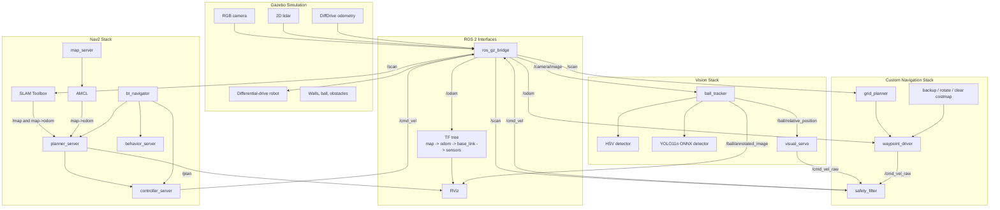

# Vision-Guided Robot Portfolio Report

This project is a simulated mobile robot built from scratch for learning robotics and AI. It started as a camera-guided red-ball follower and grew into a layered ROS 2 system with perception, control, safety, path planning, Nav2, localization, SLAM, and validation tooling.

The final system runs fully in simulation:

```text
Gazebo -> ROS 2 sensors -> perception/planning/localization -> velocity control -> Gazebo robot motion
```

## What It Demonstrates

- A differential-drive robot in Gazebo with camera, lidar, odometry, and TF.
- HSV and custom YOLO11n ONNX red-ball detection.
- Visual servoing to approach and stop near a target.
- Lidar-based safety filtering and obstacle avoidance.
- Odometry waypoint navigation and multi-waypoint missions.
- Custom grid planning, live lidar planning, path following, and recovery.
- Nav2 integration with planners, controllers, costmaps, behavior actions, and lifecycle nodes.
- Saved-map localization with AMCL.
- SLAM Toolbox mapping from `/scan`.
- Navigation on a robot-built map using AMCL and fast Nav2.
- Repeatable rosbag analysis for objective validation.

## Final Architecture



## Demo Commands

Build first:

```bash
cd ~/vision_guided_robot_ws
source /opt/ros/humble/setup.bash
colcon build --symlink-install
source install/setup.bash
```

HSV visual servo demo:

```bash
ros2 launch vision_guided_robot demo_hsv.launch.py
```

Custom ONNX visual servo demo:

```bash
ros2 launch vision_guided_robot demo_onnx.launch.py
```

Custom planned navigation demo:

```bash
ros2 launch vision_guided_robot demo_live_planned.launch.py
```

Nav2 saved-map AMCL demo:

```bash
ros2 launch vision_guided_robot demo_nav2_amcl.launch.py rviz:=true
```

SLAM mapping demo:

```bash
ros2 launch vision_guided_robot demo_slam.launch.py rviz:=true
```

Robot-built map navigation demo:

```bash
ros2 launch vision_guided_robot demo_nav2_slam_map.launch.py rviz:=true
```

## Major Validation Results

| Capability | Evidence Bag | Result |
| --- | --- | --- |
| HSV target approach | `bags/final_vision_approach` | `success: True`, stopped near ball at `final_z_m: 0.484` |
| Obstacle avoidance | `bags/final_obstacle_avoidance` | `success: True`, `AVOID` occurred, robot reacquired target |
| Waypoint navigation | `bags/final_waypoint_param` | `success: True`, reached odom goal |
| Custom A* planning | `bags/final_grid_planner_full_run` | `planner_success: True`, completed planned route |
| Live lidar planning | `bags/final_live_grid_planner_stable_state` | `success: True`, stable live replanning |
| Pure-pursuit path following | `bags/final_pure_pursuit_planner` | `FOLLOW_PATH: 86`, final odom `(1.925, 0.853)` |
| Custom recovery | `bags/final_recovery_behavior_run2` | `RECOVERING: 127`, `COSTMAP_CLEARED: 2`, `success: True` |
| ONNX target approach | `bags/final_onnx_far_improved` | `success: True`, drove from `1.788 m` to stop |
| ONNX distance calibration | `bags/final_onnx_calibrated_alignment` | `success: True`, centered and stopped after calibrated approach |
| Nav2 baseline | `bags/final_nav2_first_goal_run2` | Nav2 action `SUCCEEDED`, final error about `0.176 m` |
| Faster Nav2 | `bags/final_nav2_tight_goal` | `success: True`, `nav2_goal_error_m: 0.118` |
| Two-obstacle custom vs Nav2 | `bags/final_two_obstacle_custom`, `bags/final_two_obstacle_nav2` | Both stacks succeeded |
| Saved-map AMCL | `bags/final_nav2_amcl_clear_goal` | `/map`, `/amcl_pose`, `/plan`, and Nav2 success |
| AMCL wall passing | `bags/final_nav2_amcl_wall_pass_success` | `/navigate_through_poses` succeeded through constrained route |
| SLAM live mapping | `bags/final_slam_mapping_first_run` | `map_samples: 233`, Nav2 succeeded on live map |
| Robot-built map navigation | `bags/final_slam_map_amcl_fast_run2` | AMCL localized on saved SLAM map; fast Nav2 succeeded |

## Key Engineering Choices

| Decision | Why It Was Useful |
| --- | --- |
| Start with HSV before ML | Built the full robotics loop before adding dataset/training complexity. |
| Keep `/ball/relative_position` stable | Allowed HSV and ONNX detectors to swap without changing control. |
| Add `/cmd_vel_raw -> safety_filter -> /cmd_vel` | Separated desired motion from safety enforcement. |
| Build custom planner before Nav2 | Made planning, costmaps, and recovery mechanics easier to understand. |
| Add Nav2 after custom navigation | Connected the project to production ROS 2 navigation architecture. |
| Use rosbag analysis | Turned subjective "it works" into measurable evidence. |
| Save and pad SLAM maps | Exposed a real mapping issue: maps can be valid but cropped too tightly for Nav2. |

## What I Learned

Robotics is a system problem. A good detector alone is not enough; it must produce metric estimates that the controller can use. A good controller alone is not enough; it must be protected by safety and informed by localization. A good map alone is not enough; it must have usable bounds, correct frame transforms, and a planner/controller configuration that matches the robot.

The most important frame relationships in the final system are:

```text
odom -> base_link
map -> odom
base_link -> camera_link -> camera_optical_frame
base_link -> lidar_link
```

The most important behavior contracts are:

```text
/camera/image -> detector -> /ball/relative_position
/cmd_vel_raw -> safety_filter -> /cmd_vel
/scan + /odom -> SLAM Toolbox -> /map and map->odom
/map + /amcl_pose + /plan -> Nav2 -> /cmd_vel
```

## Known Limitations

- The project is simulation-only; hardware would introduce sensor noise, wheel slip, timing jitter, and calibration work.
- The red-ball task is narrow and color/object-specific.
- The ONNX model is CPU-slower than HSV and depends heavily on training data quality.
- Distance estimation from bounding boxes remains approximate.
- The custom planner is educational, not a production replacement for Nav2.
- Some Nav2 wall-passing success uses staged waypoints and relaxed endpoint tolerance.
- SLAM maps may need padding or cleanup before they are good navigation maps.
- There is no autonomous exploration policy yet; the robot is manually driven while mapping.

## Best Next Extensions

1. Add autonomous exploration for SLAM mapping.
2. Add map quality checks and automatic map padding/cleanup.
3. Add a real robot hardware profile.
4. Add camera calibration and better metric target localization.
5. Add a behavior-tree mission that can switch between object approach, mapping, and navigation.
6. Add CI tests for launch-file structure and non-ROS algorithm modules.

## How To Present This Project

Short version:

```text
I built a ROS 2/Gazebo mobile robot that can detect a colored object, approach it, avoid obstacles, plan paths, run Nav2, localize with AMCL, build a map with SLAM Toolbox, save that map, and navigate on the robot-built map. I validated each milestone with rosbag analysis instead of relying on visual inspection alone.
```

Interview version:

```text
The project intentionally starts simple and layers complexity. HSV detection proves the perception-control loop. ONNX detection proves learned perception. Custom planning teaches costmaps and recovery. Nav2 introduces production navigation concepts. AMCL and SLAM close the localization/mapping loop. The final demo uses a map generated by the robot itself, then localizes and navigates on it with fast Nav2.
```
